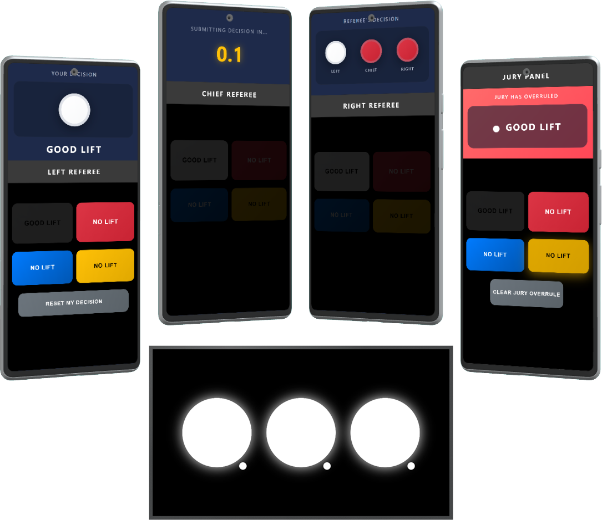

# OpenRef Lights

[](https://github.com/maandagdev/openref-lights/actions/workflows/ci.yml)
[](LICENSE)
[](https://nodejs.org)
[](https://github.com/maandagdev/openref-lights/pulls)

**A free, no-nonsense referee light system for powerlifting competitions.**

Feature-rich and open-source. Because you shouldn't need to pay hundreds of euros for three colored lights.



---

## What is OpenRef Lights?

OpenRef Lights is an open-source referee light system designed for powerlifting meets. It provides real-time communication between referees, jury members, and the competition display through an intuitive web-based interface.

**Built by [DevWorks](https://github.com/maandagdev)** , this independent open-source project serves the powerlifting community, including events organized by [KNKF Sectie Powerlifting](https://knkf-sectiepowerliften.nl/) (the Dutch national powerlifting federation).

Many referee light systems are expensive, proprietary, or require specific hardware. Creating barriers for federations and meet crews operating on limited budgets. OpenRef Lights changes that. Our goal is simple: **every federation should have access to a modern, reliable lights system** that's:

- **Free and open-source**
- **Self-hostable** (run it locally at a meet, on a small PC, or in the cloud)
- **Easy to operate** for meet staff, referees, and jury

### Key Features

- **Decisions and Failure Reasons** : ⚪ White (good lift), 🔴 Red (no lift), 🔵 Blue (no lift), 🟡 Yellow (no lift)
- **Real-time Updates** : WebSocket-based instant synchronization
- **Jury Overrule** : Jury panel support with dedicated controls
- **Multiple Interfaces** : Referee, Jury, Display, and Control views
- **Easy Deployment** : Runs on cheap hardware or in the cloud
- **Optional Authentication** : Token-based security when you need it

---

## Quick Links

| Documentation                         | Description            |
| ------------------------------------- | ---------------------- |
| [Backend README](backend/README.md)   | Backend documentation  |
| [Frontend README](frontend/README.md) | Frontend documentation |

---

## Security Considerations

**⚠️ Important: This system is designed for local/private network deployments at competitions.**

### Authentication & Network Security

OpenRef Lights uses optional token-based authentication over HTTP/WebSocket connections. **This provides protection against casual interference but is NOT secure against network-level attacks.**

### Recommended Usage

**For most competitions (Recommended):**

- Use a **dedicated, isolated network** (separate router/wifi for competition devices only)
- Enable AUTH_TOKEN to prevent casual access

  **For public facing deployments:**

- Deploy behind HTTPS using:
  - Cloud hosting (Vercel, Railway, etc. provide automatic HTTPS)
  - Self-hosted with nginx/Caddy and Let's Encrypt certificates
  - See [Docker Deployment](#docker-deployment) section for details

---

## Architecture Overview

This project is a **monorepo** managed with npm workspaces:

```
openref-lights/
├── backend/          # NestJS WebSocket server
├── frontend/         # Angular web application
├── docker/           # Docker configuration files
└── package.json      # Root workspace configuration
```

The system uses a **state machine architecture** for robust lift decision management:

```
┌───────────────────────────────────────────────────────────────────────────────────────────┐
│                                                                                           │
│   awaitingDecisions ──► collectingDecisions ──► readyToReveal ──► revealingDecisions      │
│          ▲                      │                      │                  │               │
│          │                      │                      │                  │               │
│          │                      ▼                      ▼                  ▼               │
│          │                 juryOverrule ◄──────────────┴──────────────────┘               │
│          │                      │                                                         │
│          └──────────────────────┘                                                         │
│                                                                                           │
└───────────────────────────────────────────────────────────────────────────────────────────┘
```

**How it works:**

1. Referees connect via WebSocket and the system moves to `collectingDecisions`
2. Each referee submits their decision (white/red/blue/yellow)
3. Once all decisions are in, the control panel triggers `revealingDecisions`
4. Lights display to the audience, then reset for the next attempt

---

## Getting Started

### 0. Prerequisites

Before you begin, make sure you have:

- **Node.js** 20.0.0 or higher
- **npm** 9.0.0 or higher
- **Git** for cloning the repository

### 1. Clone and Install

```bash
git clone https://github.com/maandagdev/openref-lights.git
cd openref-lights
npm install
```

npm workspaces will automatically install dependencies for both backend and frontend.

### 2. Configure Environment

**Backend** : Create a `.env` file:

```bash
# backend/.env
PORT=3000
NODE_ENV=development
CORS_ORIGIN=*
AUTH_TOKEN=           # Optional: set a token for basic access control
                      # Generate with: openssl rand -hex 32
                      # See Security Considerations section above
```

**Frontend** : Copy the example environment file:

```bash
cp frontend/src/app/environments/environment.example.ts \
   frontend/src/app/environments/environment.ts
```

Edit the file with your backend URL:

```typescript
// frontend/src/app/environments/environment.ts
export const environment = {
  debug: true, // Enable console logging for development
  backendUrl: 'http://localhost:3000',
  authToken: '', // Must match backend AUTH_TOKEN if enabled
};
```

### 3. Start Development Servers

Run both backend and frontend simultaneously:

```bash
npm run dev
```

Or start them individually:

```bash
npm run dev:backend   # Starts backend on http://localhost:3000
npm run dev:frontend  # Starts frontend on http://localhost:4200
```

---

## VS Code Workspace

This project includes a VS Code workspace file with pre-configured tasks and settings.

**Open the workspace:**

```bash
code openref-lights.code-workspace
```

### Debug Configurations

Available in the Run and Debug panel ( `Cmd/Ctrl + Shift + D` ):

- **Debug Backend** : Attach debugger to backend
- **Debug Frontend (Chrome)** : Debug frontend in Chrome
- **Full Stack** : Debug both simultaneously

### Recommended Extensions

The workspace suggests these extensions for the best experience:

- Prettier - Code formatter
- ESLint - Linting
- Angular Language Service
- Jest Runner
- Docker

---

## Available Scripts

Run these from the project root:

| Script                 | Description                     |
| ---------------------- | ------------------------------- |
| `npm run dev`          | Start both backend and frontend |
| `npm run dev:backend`  | Start only the backend          |
| `npm run dev:frontend` | Start only the frontend         |
| `npm run build`        | Build both for deployment       |
| `npm run test`         | Run all tests                   |
| `npm run lint`         | Lint all code                   |
| `npm run format`       | Format code with Prettier       |

---

## Docker Deployment

For competition deployments, you can use Docker:

```bash
# Copy and configure environment
cp .env.docker.example .env.docker
# Edit .env.docker and set AUTH_TOKEN

# Build and run
docker-compose up --build
```

This starts:

- Backend on port 3000 (HTTP)
- Frontend on port 80 (via Nginx)

  **Note:** Docker deployment uses HTTP by default. For HTTPS, you'll need to:

- Add a reverse proxy (nginx/Caddy) with SSL certificates in front
- Use a cloud platform with automatic HTTPS, or
- Use ngrok/Cloudflare Tunnel for instant HTTPS

See [backend/README.md](backend/README.md) and [frontend/README.md](frontend/README.md) for more deployment options.

---

## Contributing

We welcome contributions! Whether it's bug fixes, new features, or documentation improvements, all help is appreciated.

1. Fork the repository
2. Create a feature branch from `develop`
3. Make your changes
4. Submit a pull request

---

## License

This project is licensed under the **MIT License** . See the [LICENSE](LICENSE) file for details.

Feel free to use OpenRef Lights for your federation, gym, or competition. We'd love to hear how you're using it!

---

## Support

- **Issues:** [GitHub Issues](https://github.com/maandagdev/openref-lights/issues)

---

<p align="center">
  Made with ❤️ for the powerlifting community
</p>
